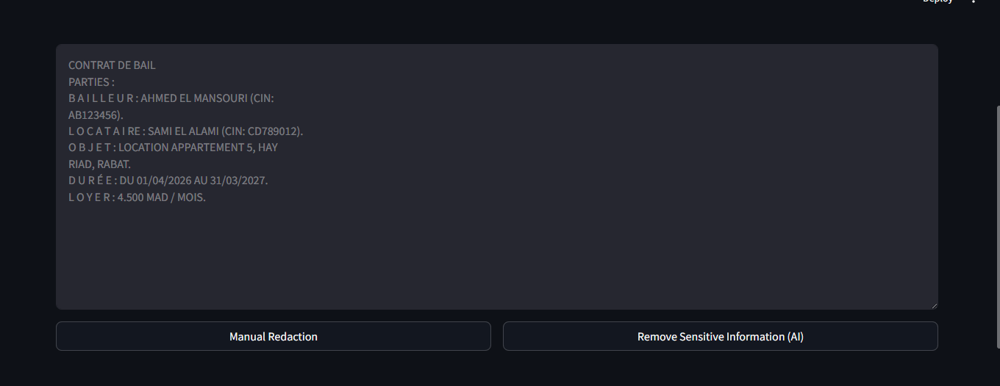
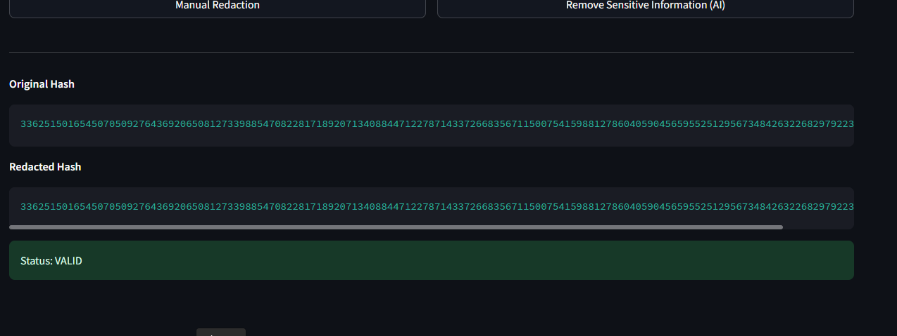

# 🔏 Redactable Blockchain for Smart Contracts

<div align="center">


**AI-powered redactable blockchain for secure contract management.**

</div>

---

## 📖 Overview

This project combines **Artificial Intelligence** and **Chameleon Hash-based Redactable Blockchain** to enable authorized modifications of legal contracts while preserving blockchain integrity. It supports automatic detection of sensitive information, secure redaction, manual editing, and cryptographic verification after every modification.

---

## ✨ Features

- 📄 Upload PDF & TXT contracts
- 🤖 AI contract analysis
- 🔍 Sensitive data detection
- 🧹 AI & selective redaction
- ✍️ Manual editing
- 🔐 Chameleon Hash verification
- 📜 Audit Log
- ✅ Blockchain integrity validation

---

## 🖼️ Preview

### Main Interface

<p align="center">

</p>

### Hash Verification

<p align="center">

</p>

---

## 🛠️ Tech Stack

- Python
- Streamlit
- OpenAI API
- PyCryptodome
- PyPDF2
- pdfplumber

---

## 🚀 Installation

```bash
git clone https://github.com/your-username/Redact_Blockchain.git
cd Redact_Blockchain

python -m venv .venv
.venv\Scripts\activate

pip install -r requirements.txt

streamlit run interface.py
```

---

## 👨‍💻 Author

**Abdelouadoud Elyanouti**

Master's Student in Artificial Intelligence
